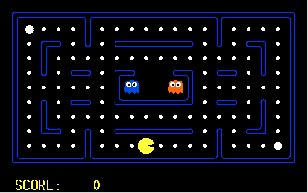

# Pac-Man MDP Agent
This work shows the implementation and statistical analysis of an AI agent capable of winning the arcade game of Pac-Man using an MDP solver that follows a policy based on Value Iteration.

A full report can be found [here](docs/report.pdf).

The game itself is also modelled as a stochastic variation of the Pac-Man game, meaning that some transitions are probabilistic. In the context of the Pac-Man game, the agent has an 80% probability of going in the direction specified by the policy, and a 10% change of going to either direction perpendicular to that.If the agent hits a wall, it will not move.

 The sole file here is meant to be used with Berkley's [Pac-Man Projects
](http://ai.berkeley.edu/project_overview.html). It therefore only contains the logic associated with a MDP agent trying to win the Pac-Man game.


## Example Game

<div align="center">

</div>

## Environment

The code is meant to be run on [Python 2.7](https://www.python.org/download/releases/2.7/)
## Instructions

Run the agent on a small grid:

```zsh
python pacman.py -p MDPAgent -l smallGrid
```

### Additional tags

#### Game tags
- `-q` to run without UI
- `-l` to specify the layout (the code was written for `-l smallGrid` and `-l mediumClassic`)
- `-n` to specify how many times to run the game (e.g.: `-n 25`)

#### Custom Constants
These constants are used to generate the utiliy values
| Constant              | Default |
|----------------------|---------|
| EMPTY_LOCATION_REWARD | -0.04   |
|FOOD_REWARD           | 10      |
| CAPSULE_REWARD        | 100     |
| GHOST_REWARD          | -1000   |
|  GAMMA                 | 0.9     |
| DANGER_ZONE_RATIO     | 6       |
| DANGER                | 500     |
| ITERATIONS            | 10      |
